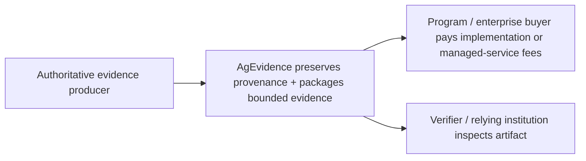
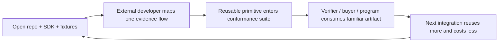

# AgEvidence

> [!NOTE]
> ## Tenacious Ventures screening branch
>
> **AgEvidence is an open evidence interoperability and reliance layer for agriculture.** It sits between heterogeneous source systems and the institutions that need to inspect, assure, finance, or otherwise rely on their outputs.
>
> This branch is a founder-prepared technical-diligence companion for Tenacious Ventures. It is **not** an internal Tenacious Ventures memorandum and does not represent Tenacious's confidential decision process.
>
> **Branch reviewed:** `release/v0.1.0-tenacious-screening`  
> **Underwriting baseline:** commit `719942f425c7dca1a867b4fd1fb7c3bfab431e75` (7 Aug 2026)  
> **Recommended review time:** 10–15 minutes
>
> This repository demonstrates architecture, schemas, reference workflows, design workspaces, and prototype verification surfaces. It does **not** establish customer adoption, methodology approval, regulatory acceptance, production security, verified emissions reductions, or revenue unless explicitly stated.

## Transaction under review

| Stage | Capital | Primary purpose | Release logic |
|---|---:|---|---|
| **Stage 1** | **US$750k** | Australian operating nexus; Wave 1 open-source design advisory; one canonical event-first proof; independent reconstruction; named reliance question | Pre-seed financing via post-money SAFE at a **US$7.5m valuation cap** |
| **Stage 2** | **up to +US$375k** | Cross-category portability; conformance/verification hardening; reliance-side recognition; paid deployment; recurring managed-evidence operations | **Not automatic.** Re-underwrite against external adoption and commercial gates |
| **Maximum staged financing** | **US$1.125m** | 18-month staged proof of adoption and commercial reuse | Avoid committing full capital before reuse and conversion are demonstrated |

Stage 1 is primarily a **market-formation and interoperability proof**, not a broad engineering hiring plan. The founder remains the principal engineer; capital is intended to prove that the evidence boundary survives external use and becomes commercially valuable.

---

## 10-minute IC review path

| Underwriting question | Start here | What the branch should let you inspect |
|---|---|---|
| **1. Is there a real agricultural problem?** | [Canonical agricultural workflow](#1-canonical-agricultural-workflow) | A recognizable methane-intervention evidence chain rather than protocol abstraction |
| **2. Is the architecture credible?** | [Thin-waist system boundary](#2-thin-waist-system-boundary) | Separation of source authority, scientific models, review, jurisdiction logic, and portable verification |
| **3. What actually exists today?** | [Repository evidence map](#3-repository-evidence-map) | Current Rails, Rust, Python, specifications, and workspace surfaces |
| **4. Why Australia first?** | [Australia as the first standard-formation market](#5-australia-as-the-first-standard-formation-market) | A strategically meaningful ANZ operating and adoption thesis |
| **5. Can open source create venture value?** | [Open standard, commercial operator](#7-open-standard-commercial-operator) | Where value capture must compound around the public protocol |
| **6. Can adoption scale without a large sales organization?** | [Developer-led adoption](#8-developer-led-adoption) | Protocol-led distribution, Country Adoption Cell, and anti-vanity metrics |
| **7. What must the financing prove?** | [Stage gates](#10-stage-gates) | External milestones separating technical activity from investable progress |
| **8. What remains unproven?** | [Maturity and diligence gaps](#4-current-maturity-and-diligence-gaps) | Explicit claims discipline and the next technical proof points |

## Underwriting thesis

AgEvidence is not best evaluated as another agricultural carbon platform.

The core bet is narrower:

> **Can a neutral evidence boundary preserve identity, authority, provenance, observation/derivation semantics, gaps, human review, and bounded artifacts across multiple agricultural technologies — and can relying institutions reuse that boundary instead of repeatedly rebuilding bespoke evidence pipelines?**

If every implementation remains bespoke founder consulting, the thesis fails. If later implementations materially reuse evidence primitives, adapters, reviewer semantics, artifact profiles, and deployment tooling, marginal integration cost should fall while network utility and operating defensibility rise.

---

# 1. Canonical agricultural workflow

Start with an agricultural transaction, not cryptography.

A methane-reduction intervention is deployed to a cattle operation. Different systems may hold different parts of the evidence chain:

1. **Intervention deployment** — product, batch/lot, delivery, cohort and relevant operational context are recorded by authoritative systems.
2. **Operational recording** — dosing/feeding events, device identity, timestamps, calibration references and source-document context are captured where applicable.
3. **Evidence intake** — AgEvidence receives either **Path A: signed operational events** or **Path B: controlled source manifests** while preserving source authority.
4. **Evidence projection** — source evidence is normalized into inspectable evidence state; missing or conflicting evidence remains visible.
5. **Model boundary** — external scientific or biophysical calculations remain separately versioned and attributable. AgEvidence records inputs, model/method identity, outputs and derivation lineage without becoming the scientific authority.
6. **Human review** — determinations, exceptions, insufficiencies and unresolved questions are recorded separately from machine processing.
7. **Program/jurisdiction interpretation** — versioned adapters evaluate unchanged evidence against a named method, buyer rule or institutional profile.
8. **Bounded artifact** — a portable artifact states what evidence is present, what is missing, what profile/version was applied and what bounded claim is being made.
9. **External reliance** — a verifier, buyer, program operator, lender, insurer, assurance team or auditor can inspect the artifact without privileged access to every upstream proprietary database.
10. **Allocation and settlement remain separate** — credit issuance, claim allocation, incentive payment and financial settlement remain with the relevant program or commercial counterparty.

> [!IMPORTANT]
> **Integrity is not scientific efficacy. Scientific efficacy is not method eligibility. Method eligibility is not verification. Verification is not institutional reliance. Reliance is not ownership, allocation, payment, or revenue recognition.**

That separation is the product boundary.

---

# 2. Thin-waist system boundary

```mermaid
flowchart LR
    subgraph U[Upstream source systems]
      A[Telemetry]
      B[Sensors]
      C[Labs]
      D[Farm software]
      E[Remote sensing]
      F[MRV / models]
      G[Project / transaction systems]
    end

    subgraph AE[AgEvidence thin waist]
      H[Identity + authority]
      I[Provenance]
      J[Observation / derivation semantics]
      K[Gaps + human review]
      L[Versioned interpretation]
      M[Bounded artifacts]
    end

    subgraph R[Relying systems]
      N[Buyers]
      O[VVBs / assurance]
      P[Programs]
      Q[Finance / insurance]
      S[Audit]
    end

    U --> AE --> R
```



| Boundary | AgEvidence responsibility | Explicit non-responsibility |
|---|---|---|
| **Source identity** | Preserve authority, identifiers, timestamps and evidence type | Replace the source system or become the universal farm system of record |
| **Observation vs derivation** | Preserve whether evidence is observed, document-derived or model-derived | Decide scientific truth or invent model results |
| **Provenance** | Preserve lineage and references to controlled source records | Own all proprietary raw data by default |
| **Gap semantics** | Make missing expected evidence visible | Treat absence as a valid negative finding |
| **Human review** | Preserve determinations, exceptions, overrides and unresolved questions | Automate away expert judgment |
| **Country/program adapter** | Apply versioned interpretation to unchanged evidence | Rewrite historical evidence to fit a later rule |
| **Portable artifact** | Package bounded evidence for external inspection | Become the verifier, registry, marketplace or settlement rail |

The architecture is intentionally heterogeneous. AgEvidence becomes useful **because** farm systems, scientific models, robotics, sensors, project platforms, registries, transaction rails and assurance systems have legitimate reasons to remain specialized.

---

# 3. Repository evidence map

The screening branch is a multi-language technical scaffold, not a single Rails application pretending to own every trust boundary.

## 3.1 Current stack

| Layer | Current branch surface | Diligence interpretation |
|---|---|---|
| **Rails workflow/control plane** | Ruby `3.3.12`; Rails `~> 7.1`; domain models and services under `athian_ink_rails_bootstrap/` | Hosted workflow and commercial-control-plane scaffold exists; production hardening is not established |
| **Rust trust boundary** | `baink-core`, `baink-schema`, `baink-canonical`, `baink-crypto`, `baink-bundle`, `baink-verify`, `baink-agevidence`, `baink-cli` | Canonicalization, bundling and portable verification can remain separable from Rails |
| **Python SDK** | `sdks/python/`; package `agevidence` v0.1.0; Python 3.11+; CLI entry point | Developer-oriented integration surface exists |
| **Specifications** | `specs/agevidence/contracts/`, schemas, examples, country adapters and vocabulary | Public evidence grammar and conformance surface exists |
| **Model boundary** | `services/agevidence-model/` plus Rails model-run ingestion/client surfaces | External calculations can remain separately attributable |
| **Design workspaces** | `Wave 1/`, `Wave 2/`, charters and reference workspaces | Adoption hypotheses are inspectable in-repo; workspace presence is **not** adoption |

## 3.2 Corrected Rails implementation map

The paths below are the current branch surfaces. They intentionally replace older illustrative README references that had drifted from the codebase.

| Evidence concern | Current repository surface |
|---|---|
| Integration event intake | `athian_ink_rails_bootstrap/app/models/integration_event.rb` |
| Evidence candidate | `athian_ink_rails_bootstrap/app/models/agevidence/evidence_candidate.rb` |
| Controlled source record | `athian_ink_rails_bootstrap/app/models/agevidence/source_record.rb` |
| Source-record projection | `athian_ink_rails_bootstrap/app/services/agevidence/source_record_projection.rb` |
| Evidence gap state | `athian_ink_rails_bootstrap/app/models/agevidence/evidence_gap.rb` |
| Human review decision | `athian_ink_rails_bootstrap/app/models/agevidence/review_decision.rb` |
| Model-run boundary | `athian_ink_rails_bootstrap/app/models/agevidence/model_run.rb`<br>`athian_ink_rails_bootstrap/app/services/agevidence/model_run_ingestion.rb`<br>`athian_ink_rails_bootstrap/app/services/agevidence/model_service_client.rb` |
| Country/program interpretation | `athian_ink_rails_bootstrap/app/services/agevidence/country_adapter_catalog.rb`<br>`athian_ink_rails_bootstrap/app/services/agevidence/country_eligibility_evaluator.rb`<br>`athian_ink_rails_bootstrap/app/services/agevidence/policy_stack_resolver.rb` |
| Artifact assembly | `athian_ink_rails_bootstrap/app/services/agevidence/artifact_assembler.rb` |
| Artifact fulfillment | `athian_ink_rails_bootstrap/app/services/agevidence/artifact_order_fulfillment.rb` |
| Receipt issuance | `athian_ink_rails_bootstrap/app/services/agevidence/receipt_issuer.rb`<br>`athian_ink_rails_bootstrap/app/services/agevidence/receipt_outbox_processor.rb` |
| Portable verification | `crates/baink-verify/`<br>`crates/baink-cli/` |

See [`athian_ink_rails_bootstrap/docs/implementation-map.md`](./athian_ink_rails_bootstrap/docs/implementation-map.md) for the broader Rails/UI implementation map.

---

# 4. Current maturity and diligence gaps

A useful IC view separates four maturity classes.

| Maturity class | Current status |
|---|---|
| **Implemented scaffold** | Intake, source records, evidence-gap state, review decisions, country-policy structures, model-run ingestion, artifact assembly, receipt issuance, SDK/CLI and Rust verification crates are present |
| **Reference proof** | Synthetic fixtures and design workspaces can exercise intended evidence flows |
| **External validation** | **Not yet demonstrated by this branch.** No repository evidence establishes production acceptance by a design-advisor company, verifier, buyer or program |
| **Production readiness** | **Not demonstrated.** Do not infer SOC 2, enterprise security approval, production SLOs, regulated-method eligibility or recognized assurance acceptance |

### Current capability framing

| Capability | Current branch | Next investable proof |
|---|---|---|
| Signed event intake | Working scaffold | External design-advisor mapping |
| Controlled source manifests | Working scaffold | Biological/source-record reference profile |
| Gap representation | Working scaffold | External sufficiency/reviewer semantics |
| Human review decisions | Working scaffold | Verifier/assurance workflow review |
| Python SDK / CLI | Working | External developer implementation |
| Independent verifier | Prototype | Non-founder artifact reconstruction |
| Model execution | Fixture-backed / separable | Bounded external model workflow |
| Country adapters | Scaffolded | Expert/institutional review of a named profile |
| Customer adoption | Not established | Paid bounded implementation or managed deployment |
| Revenue | Not established | Collected commercial payment |
| Regulatory / methodology acceptance | Not established | Appropriate external recognition |

> [!WARNING]
> **Known diligence gap:** the reviewed branch does not expose a `.github/workflows` CI surface. Local verification instructions exist, but deterministic clean-checkout CI, release signing, conformance artifacts and reproducible release evidence remain work to be completed rather than capabilities to imply.

---

# 5. Australia as the first standard-formation market

Australia is not a nominal geographic sales territory. It is proposed as the first **standard-formation and commercialization jurisdiction**.

The thesis is that Australian agriculture creates a useful interoperability test because it combines:

- climate-related reporting and assurance requirements;
- material livestock methane evidence needs;
- evolving intervention/methodology requirements;
- extensive and remote production systems;
- export-oriented supply chains;
- telemetry, sensing, geospatial, biological and source-record evidence classes; and
- a strategically meaningful ANZ operating requirement for this financing thesis.

### Stable kernel vs jurisdiction-specific interpretation

**Stable evidence kernel**

`source → authority → observation/derivation → provenance → gaps → review → artifact`

**Jurisdiction/program layer**

`method → program → assurance profile → institution → version → decision context`

The portability claim is a hypothesis to test, not something this branch assumes. New Zealand is the natural adjacent test: reuse the evidence kernel under a different institutional/methodological adapter without forking the core.

---

# 6. Open design program: Wave 1 → Wave 2

The design program is not a collection of logos. It is a controlled test of whether evidence primitives survive increasingly different operational systems and evidence classes.

> [!IMPORTANT]
> **Design advisory is not a disguised unpaid pilot and not commercial proof.** A public workspace does not count as adoption. An active design advisor requires substantive workflow correction, terminology/source review, or artifact review by the company or an authorized domain expert.

## Wave 1 — Event-First Systems Working Group

Wave 1 asks:

> **Can multiple operational systems share evidence primitives without adopting a common application?**

| Reference workspace | Primary stress test | Reusable primitive being tested |
|---|---|---|
| **DIT AgTech** | Dosing telemetry | Intervention/dosing event, device identity, batch/lot, calibration and cohort references |
| **MEQ Solutions** | Measurement + larger payloads | Observation identity, payload references, model boundary, measurement metadata |
| **Agscent** | Sensor/calibration/model boundary | Calibration provenance, sensor identity, direct observation vs derived prediction |
| **Cibo Labs** | Remote observation | Spatial observation, temporal coverage, remote-sensing source lineage |
| **Agronomeye** | Geospatial provenance | Geometry/version identity, spatial source records, map-layer lineage |

## Wave 2 — Cross-category portability

Wave 2 asks:

> **Can the same evidence grammar retain utility when the underlying evidence class changes?**

The current branch intentionally separates two cohorts:

- **Cohort A — Event-First:** `ProAgni`
- **Cohort B — Source-Record-First:** `Bovotica`, `Number 8 Bio`

Wave 2 should force the protocol into document-heavy, biological, assay, batch-certificate, feed/intervention and other source-record contexts that may require materially different provenance structures.

### Design-to-commercial ladder

`Prepared → Reviewed → Advised → Demonstrated → Commercially Partnered`

A company moves beyond design advisory only when a concrete implementation, managed operation or bounded reliance deliverable is commercially procured.

---

# 7. Open standard, commercial operator

The central venture objection is valid:

> **If the schemas, fixtures, conformance tests and verification logic are open, why must anyone pay AgEvidence?**

The answer must be operational, not rhetorical.

| Public / open layer | Commercial operator layer | Potential compounding asset |
|---|---|---|
| Schemas + evidence contracts | Hosted workflow/control plane | Production implementation history |
| Canonical fixtures + conformance tests | Private source mappings + integration services | Reusable mapping and deployment patterns |
| Verification logic | Managed evidence operations | Institutional operating trust, uptime and support |
| Country/method profile structures | Maintained production profiles + change management | Accepted artifact profiles and reviewer expectations |
| SDK / CLI | Enterprise connectors, permissions, SLAs and audit workflows | Installed base and cross-company compatibility |
| Open governance | Accountable commercial operator | Network utility around a shared evidence grammar |

The moat is **not code secrecy**. It must become accumulated demonstrated compatibility between source systems and relying institutions, plus the operating capability to run that compatibility reliably.

### Economic chain



The farmer does not need to be the primary payer. Willingness to pay may sit with the organization carrying an external reporting, claims, financing or assurance obligation and currently bearing reconciliation cost.

---

# 8. Developer-led adoption

The Stage 1 thesis is **not** that a B2B infrastructure company will never need sales.

It is more disciplined:

- no dedicated field-sales team initially;
- protocol-led, developer-first distribution;
- target engineers at already-funded agrifood technology companies with open specifications, SDKs, fixtures and reference workspaces;
- founder-led commercial work converts real implementation/reliance needs into paid engagements; and
- dedicated sales headcount is deferred until the data show where human commercial intervention is actually required.

## Country Adoption Cell

Each launch market is treated as an adoption system composed of functions, not assumed salaried headcount.

| Function | Participant type | Contribution |
|---|---|---|
| **Technology provider** | Agrifood startup / source system | Supplies a real operational evidence flow and implementation constraints |
| **Developer** | Engineer inside participating company | Tests SDK/schema usability and implements a mapping |
| **Scientific/domain authority** | Researcher or qualified expert | Tests terminology, measurement assumptions and model boundaries |
| **Verification/assurance** | VVB, assurance practitioner, auditor, technical reviewer | Tests reconstructability and evidence-sufficiency language |
| **Buyer/program** | CPG, processor, program operator, institutional buyer | Supplies a concrete reliance question and willingness-to-pay context |
| **Government/standards context** | Regulator, program owner, standard-setter, industry body | Defines jurisdictional requirements without delegating decision rights to AgEvidence |
| **AgEvidence steward** | Protocol maintainer / commercial operator | Maintains contracts, conformance, workspaces, releases and managed operations |

## Developer-first distribution loop



### Metrics that matter

Do **not** optimize for GitHub stars, workspace count or non-binding interest.

Track:

- time from developer onboarding to first conformant event/manifest;
- percentage of each new implementation using existing primitives without schema changes;
- implementation hours per company;
- number of artifacts independently reconstructed by non-founder reviewers;
- relying institutions able to consume artifacts from more than one technology provider;
- percentage of new integrations initiated without founder-originated outbound activity (**unassisted adoption ratio**);
- design-advisor → paid readiness/implementation conversion; and
- recurring managed-evidence ACV and gross margin once production contracts begin.

---

# 9. Portfolio complementarity without portfolio dependency

Tenacious's portfolio is a useful microcosm of the interoperability problem, not AgEvidence's customer pipeline.

| Company / layer | Potential relationship to AgEvidence |
|---|---|
| **Cecil — project workflow** | Portable project evidence and review lineage can move beyond one project-management environment |
| **Geora — provenance / finance** | Authoritative transaction records can enter an evidence chain, or evidence objects can accompany finance/provenance workflows |
| **Regrow — MRV / modeling** | Preserve input, model/method, version and output lineage while scientific calculation remains external |
| **SwarmFarm — autonomous operations** | Selected as-applied/task events can become upstream operational evidence without replacing fleet operations |
| **Agovor — robotic operations** | Machine task, energy and treatment records can become evidence inputs |
| **Azaneo — intervention hardware** | Treatment/activity records can support bounded evidence of management change while efficacy remains separately established |
| **Earthodic — materials** | Controlled source manifests can preserve batch, certificate, composition or chain-of-custody records |
| **Goterra — processing infrastructure** | Waste receipt, processing and diversion records can be normalized for downstream claims |

**None of these are represented as committed integrations.** AgEvidence must be underwritten on the assumption that no Tenacious portfolio company adopts it.

---

# 10. Stage gates

The staged financing should be monitored against external evidence, not repository activity alone.

## Stage 1 operating gates

| Timing | Required evidence | What it tests |
|---|---|---|
| **30 days** | Australian operating plan; five Wave 1 workspaces prepared/circulated; ≥2 substantive external workflow corrections | Can the founder recruit genuine technical engagement rather than only publish hypotheses? |
| **90 days** | ≥3 active design advisors; one real evidence flow represented; one independent reconstruction; one named external reliance question | Has the protocol survived first external contact? |
| **6 months** | Formal Australian operating nexus; reusable livestock evidence profile; ≥1 verifier/assurance review; ≥1 commercial implementation/readiness proposal | Is technical proof becoming market-specific infrastructure? |
| **12 months** | Paid bounded implementation or managed-evidence account; material reuse across ≥2 companies; one external relying institution reviews/uses an artifact | Do commercial value and cross-company reuse both exist? |

## Stage 2 activation gate — release of up to US$375k

Stage 2 is **not** triggered by internal technical completion alone. Before broader cross-category hardening, require:

- at least **3 active design advisors** with substantive documented feedback;
- at least **2 distinct operational evidence types** using materially shared primitives;
- **1 independently reconstructable artifact** tested by a non-founder reviewer;
- **1 verifier/assurance participant** that has reviewed the evidence grammar or artifact;
- **1 named buyer/program reliance question**; and
- either a **paid implementation/readiness engagement** or a **signed commercial proposal** with defined scope, price, counterparty and procurement path.

## Stage 2 exit / next-round network outcome

The later cross-category threshold is a network outcome, **not a substitute for revenue** and **not the Stage 2 activation trigger**:

- ≥ **3 conformant technology providers**;
- across ≥ **2 evidence domains**;
- + **1 independent verifier / assurance participant**;
- + **1 active buyer or program** able to consume the format;
- + **1 paid deployment**, preferably including a recurring managed-evidence account;
- material reuse such that the second or third implementation is demonstrably faster/cheaper than the first; and
- adoption that no longer depends entirely on founder-originated outbound activity.

---

# 11. What changes investment conviction

## Conviction should increase if

1. an Australian technology provider substantively corrects and then implements a reference evidence flow;
2. a verifier/assurance practitioner independently reconstructs the resulting artifact;
3. a buyer/program supplies a specific reliance question;
4. a second company reuses a meaningful portion of the first company's evidence primitives; and
5. that sequence produces a paid bounded implementation or managed-evidence engagement without first requiring a dedicated sales team.

## The thesis should be rejected if

- the recurring evidence problem is mainly bespoke consulting rather than reusable infrastructure;
- source-system companies see insufficient value to integrate or export evidence;
- relying institutions insist on proprietary bilateral formats with no willingness to consume neutral artifacts;
- the open standard creates no differentiated commercial operator role;
- Australia becomes a nominal mandate fit rather than the center of the operating/adoption plan;
- scope expands into generic farm data warehousing, proprietary scientific modeling or unrelated platform features before reuse is demonstrated; or
- the repository cannot be made reproducible and externally inspectable at modest cost.

---

# 12. Local inspection and proof surfaces

The commands below expose the current component-level test and inspection surfaces. They should **not** be confused with the still-required single deterministic clean-checkout diligence path and CI/release evidence.

## Rails

```bash
cd athian_ink_rails_bootstrap
bin/setup
bin/rails db:migrate db:seed
npm run build
bin/dev
```

Then inspect the AgEvidence workspace at:

```text
http://localhost:3000/agevidence
```

## Python model service

```bash
cd services/agevidence-model
python3 -m pytest
```

## Python SDK / CLI

```bash
cd sdks/python
python3 -m pip install -e .
agevidence --help
```

## Rust trust boundary

```bash
cargo test --workspace
cargo build -p baink-cli
```

## Manifest / conformance inspection

```bash
python3 scripts/agevidence_manifest_check.py
```

### Pre-external-diligence technical target

A clean checkout should ultimately support one deterministic Australian reference path:

```text
source event / source manifest
        ↓
normalized evidence state
        ↓
explicit gaps
        ↓
human review decision
        ↓
versioned AU profile
        ↓
bounded artifact
        ↓
portable Rust verification
```

with reproducible CI and release artifacts.

---

# 13. Open design governance

AgEvidence is developed through public specifications, synthetic reference cases, working implementations and open design review.

### Participation rules

- design-advisory participation is voluntary and advisory;
- AgEvidence funds and maintains the shared open design environment;
- maintainers remain responsible for repository decisions, releases, security and technical direction;
- public workspaces are reference cases, not assertions of adoption or endorsement; and
- commercial proof begins only when a participant or relying institution procures implementation, managed operations or a bounded reliance deliverable.

See [`Wave 1/`](./Wave%201/) for the current design-advisory structure.

---

# 14. Contributing, security and license

- [Contributing](./CONTRIBUTING.md)
- [Security](./SECURITY.md)
- [License](./LICENSE)

---

## Screening-branch decision rule

This branch is successful only if it makes the following question easier to answer:

> **Can AgEvidence turn an open evidence grammar into reusable agricultural infrastructure — first in Australia, then across evidence classes and jurisdictions — while preserving source authority and scientific/institutional decision rights, reducing repeated reconciliation work, and creating a commercial managed-evidence layer that customers will pay to operate?**
