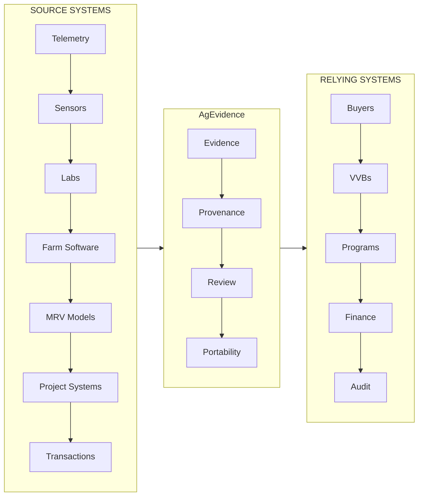

# AgEvidence

> [!NOTE]
> ## Tenacious Ventures screening branch
>
> This branch is a technical diligence companion for Tenacious Ventures.
>
> It is organized to answer five questions:
>
> 1. What does AgEvidence actually do?
> 2. What exists in the repository today?
> 3. Why is Australia the first adoption market?
> 4. How does AgEvidence complement rather than duplicate existing agrifood platforms?
> 5. What does the proposed two-stage investment need to prove?
>
> **Recommended review time:** 10–15 minutes.
>
> This branch demonstrates architecture and reference workflows.
> It does **not** claim customer adoption, methodology approval,
> regulatory acceptance, verified emissions reductions, or revenue
> unless explicitly stated.

## 10-minute Tenacious review path
If you are reviewing AgEvidence as an investment, follow this path:
| Review question | What to inspect | What it demonstrates |
|---|---|---|
| 1. Is there a real product? | [Working demonstration](#3-walk-one-evidence-flow) | Existing end-to-end architecture |
| 2. Is this more than another MRV platform? | [System boundary](#2-where-agevidence-sits) | Neutral evidence layer rather than model/project replacement |
| 3. Why Australia? | [Australian adoption wedge](#5-why-australia-first) | ANZ commercialization and design-advisory strategy |
| 4. Can this become infrastructure? | [Wave 1 → Wave 2](#6-industry-adoption-strategy) | Cross-company and cross-category reuse |
| 5. Does it help the Tenacious portfolio? | [Portfolio enablement](#7-tenacious-portfolio-enablement) | Complementarity rather than duplication |
| 6. What remains unproven? | [Current maturity](#8-what-exists-and-what-does-not) | Claims discipline |
| 7. Can I inspect it myself? | [Run it](#9-run-the-proof-path-yourself) | Reproducibility |

## 1. The problem in one evidence chain

A methane-reduction product is delivered to a cattle property.
The technology provider may know:
  what product was delivered
  which batch it came from
  when dosing occurred
A sensor may know:
  what was measured
  when
  using which calibration
A model may know:
  how those observations translate into an estimated outcome
A verifier may need:
  source provenance
  missing-record disclosure
  model/version information
  reviewer determinations
A buyer may ultimately ask:
  "What exactly am I relying on?"

The problem is not that none of these systems exist.
The problem is that the evidence has to survive the boundaries between them.

## 2. Where AgEvidence sits

AgEvidence does not need to become the source system, scientific model, project manager, registry, verifier, marketplace, or settlement platform.



### What AgEvidence does
- Connects signed events and controlled source records
- Identifies missing evidence and preserves human review
- Generates bounded artifacts for institutional use

### What AgEvidence explicitly does not do
- Replace farm-management systems, sensors, laboratories, model providers
- Act as a project developer, registry, verifier, or assurance platform
- Create scientific models or make efficacy claims
- Handle financial settlement or marketplace transactions

## 3. Walk one evidence flow

### 3.1 Source event
**What happens:** An operational record arrives from a source system (e.g., a supplement dosing event from a farm management system).
**Why it matters:** AgEvidence begins with evidence generated by another authoritative system; it does not invent the source observation.
**Where to look:** 
- `athian_ink_rails_bootstrap/app/models/agevidence/evidence_candidates/`
- `specs/agevidence/examples/`
- Synthetic fixtures in `athian_ink_rails_bootstrap/test/fixtures/`

### 3.2 Evidence contract
**What happens:** The source event is transformed into a standardized evidence event.
**Why it matters:** Creates a machine-readable boundary between source systems and the evidence layer.
**Example:**
```json
{
  "event_type": "supplement.dosing.observed",
  "occurred_at": "2024-01-15T10:30:00Z",
  "subject": "cow_12345",
  "source_system": "farm_management_v2",
  "evidence_type": "direct_observation"
}
```
**Where to look:** `specs/agevidence/contracts/`

### 3.3 Evidence is projected
**What happens:** The evidence event is appended to an immutable evidence graph.
**Why it matters:** Enables gap detection by making missing evidence visible.
**Where to look:** 
- `athian_ink_rails_bootstrap/app/services/agevidence/projection_service.rb`
- `athian_ink_rails_bootstrap/app/models/agevidence/evidence_graph.rb`

### 3.4 Missing evidence remains visible
**What happens:** The system identifies expected evidence that is absent.
**Why it matters:** Makes evidence gaps explicit rather than hiding them.
**Example:**
```
��✓ dosing event
��✓ device identity
��✓ source timestamp
? calibration evidence
? animal/cohort association
```
**Where to look:** `athian_ink_rails_bootstrap/app/services/agevidence/gap_analyzer.rb`

### 3.5 Human review remains separate
**What happens:** Machines flag gaps; humans make determinations.
**Why it matters:** Preserves the distinction between automated processing and human judgment.
**Machine:** calibration record missing
**Reviewer:** accepted for demonstration only; not sufficient for production reliance
**Where to look:** 
- `athian_ink_rails_bootstrap/app/models/agevidence/review_ledger.rb`
- `athian_ink_rails_bootstrap/app/views/agevidence/evidence_gaps/`

### 3.6 Country/program interpretation is applied
**What happens:** Versioned adapters map evidence to local rules without altering core evidence.
**Why it matters:** The same evidence graph can be evaluated under different jurisdictional interpretations.
**Where to look:** `specs/agevidence/country_adapters/`

### 3.7 A bounded artifact is released
**What happens:** A portable reliance artifact is generated, asserting specific claims about the evidence.
**Why it matters:** Creates a verifiable unit that can travel outside the hosted application.
**Where to look:** 
- `athian_ink_rails_bootstrap/app/services/agevidence/artifact_service.rb`
- `crates/baink-bundle/`

### 3.8 Verification happens outside Rails
**What happens:** The artifact's integrity and claims are checked by an independent verifier.
**Why it matters:** Establishes a trust boundary between hosted workflow and external verification.
**Where to look:** 
- `crates/baink-verify/`
- `scripts/agevidence_manifest_check.py`

**What this demonstration proves:** the software architecture can preserve and transport a bounded evidence chain.
**What it does not prove:** efficacy, methodology eligibility, verification acceptance, customer adoption, regulatory acceptance, or commercial reliance.

## 4. Show me the implementation

### Repository evidence map
| Concept | Repository surface | What reviewer should learn |
|---|---|---|
| Evidence contracts | `specs/agevidence/contracts/` | Stable machine-readable boundary |
| Event intake | `athian_ink_rails_bootstrap/app/models/agevidence/evidence_candidate.rb`<br>`athian_ink_rails_bootstrap/app/services/agevidence/event_intake_service.rb` | Source events enter workflow |
| Gap projection | `athian_ink_rails_bootstrap/app/services/agevidence/gap_analyzer.rb`<br>`athian_ink_rails_bootstrap/app/models/agevidence/evidence_gap.rb` | Missing evidence stays explicit |
| Human review | `athian_ink_rails_bootstrap/app/models/agevidence/review_ledger.rb`<br>`athian_ink_rails_bootstrap/app/views/agevidence/review_ledgers/` | Human determinations are preserved |
| Country adapters | `specs/agevidence/country_adapters/`<br>`sdks/python/src/agevidence/countries/` | Program rules do not rewrite evidence |
| Python SDK | `sdks/python/src/agevidence/` | External developers can integrate |
| Model service | `services/agevidence-model/` | Derived calculations remain separable |
| Canonical verification | `crates/baink-verify/`<br>`crates/baink-cli/` | Trust boundary is outside Rails |
| Wave 1 | `Wave 1/` | Open design methodology |
| Wave 2 | `Wave 2/` | Cross-category portability hypothesis |

### Product surfaces
| Surface | Purpose |
|---|---|
| AgEvidence Workspace | Inspect projects, source records, gaps, reviews and outputs |
| Evidence Event Inbox | Receive append-only signed events from upstream systems |
| Controlled Source Records | Register files and exports when native event integration is unavailable |
| Evidence Gap Analyzer | Identify missing, conflicting or unsupported evidence |
| Human Review Ledger | Preserve determinations, exceptions, overrides and unresolved questions |
| Developer OS | Create projects and integrate through APIs, SDKs and webhooks |
| Country Programs | Interpret one evidence graph through versioned local adapters |
| Reliance Artifacts | Produce bounded outputs for buyers, verifiers and program operators |
| Portable Verification | Verify released artifacts outside the hosted application |

### Trust boundary
The hosted Rails application presents workflow state and coordinates human review. It does not directly perform canonical hashing, signing, bundling, or independent verification. Those operations remain behind the released receipt and verifier boundary.

## 5. Why Australia first

Australia is not being used merely as a geographic sales territory.
It is the first standard-formation environment.

### Stable core vs jurisdiction adapters
- **Stable core:** event, source, authority, observation, derivation, review, artifact
- **Australian adapter:** method, program, assurance, institution, jurisdiction

### Initial livestock/Scope 3 wedge
Livestock climate interventions
+
Remote/extensive production
+
Operational telemetry
+
Biological/source-record evidence
+
Scope 3 demand
+
Assurance requirements
=
high-value interoperability test

## 6. Industry adoption strategy

The purpose of the design program is to determine whether the same evidence primitives survive contact with increasingly different real-world systems.

### Wave 1 — prove reuse within operational systems
Current branch:
* DIT AgTech (dosing telemetry)
* MEQ Solutions (measurement + larger payloads)
* Agscent (sensor/calibration/model boundary)
* Cibo Labs (remote observation)
* Agronomeye (geospatial provenance)

| Case | What it stress-tests |
|---|---|
| DIT | dosing telemetry |
| MEQ | measurement + larger payloads |
| Agscent | sensor/calibration/model boundary |
| Cibo | remote observation |
| Agronomeye | geospatial provenance |

### Wave 2 — prove reuse across evidence categories
Source-record-first / biological / more heterogeneous systems.

**Wave 1 asks:** Can several event-producing systems share evidence primitives?
**Wave 2 asks:** Do those primitives survive when the underlying evidence class changes?

### Cross-Category Market Threshold
Publishing schemas is not adoption.
The working threshold is:
- ≥3 conformant technology providers
- across ≥2 evidence domains
- + 1 independent verifier / assurance participant
- + 1 active buyer or program
At that point the evidence language begins to have utility independent of any single implementation.

### Adoption flywheel
First integration
    � ↓
creates reusable primitive
    � ↓
second integration reuses it
    � ↓
second evidence class tests portability
    � ↓
reviewer learns one evidence grammar
    � ↓
buyer consumes multiple technologies
    � ↓
next integration becomes cheaper

## 7. Tenacious portfolio enablement

AgEvidence becomes more valuable when these systems coexist; it does not require them to collapse into one platform.

| Portfolio layer | Example | AgEvidence role |
|---|---|---|
| Project management | Cecil | portable evidence export |
| MRV/modeling | Regrow | preserve input/method/output lineage |
| Autonomous operations | SwarmFarm | operational event evidence |
| Robotics | Agovor | standardized task/activity records |
| Intervention hardware | Azaneo | treatment/activity evidence |
| Transaction/provenance | Geora-type systems | consume authoritative transaction records |

## 8. Current maturity

| Capability | Current branch | Next proof |
|---|---|---|
| Signed event intake | Working | real design-advisor mapping |
| Source manifests | Working | biological reference profile |
| Gap projection | Working | external reviewer semantics |
| Human review | Working | verifier workflow review |
| Python SDK / CLI | Working | external implementation |
| Independent verifier | Prototype | reconstruction by third party |
| Model execution | Fixture-backed | bounded real model workflow |
| AU adapters | Scaffolded | expert/institution review |
| Customer adoption | Not established | paid bounded implementation |
| Revenue | Not established | collected commercial payment |
| Regulatory acceptance | Not established | appropriate external recognition |

## 9. What the staged investment is intended to prove

**Stage 1 — US$750k**
Wave 1 + Australian operating nexus
PROVE:
multiple operational systems
        � ↓
reusable evidence primitives
        � ↓
independently reconstructable artifact
        � ↓
named downstream reliance question
        � ↓
first commercial deployment signal

**Stage 2 — +US$375k**
Cross-category adoption
PROVE:
event-first + source-record-first
        � ↓
cross-company reuse
        � ↓
verifier recognition
        � ↓
buyer/program recognition
        � ↓
paid deployment

## 10. Run the proof path yourself

### Rails
```bash
cd athian_ink_rails_bootstrap
bin/setup
bin/rails db:migrate db:seed
npm run build
bin/dev
```
Then visit: http://localhost:3000/agevidence

### Python
```bash
cd services/agevidence-model
python3 -m pytest
cd sdks/python
python3 -m pip install -e .
agevidence --help
```

### Rust verifier
```bash
cargo test --workspace
cargo build -p baink-cli
```

### One-command verification target
```bash
# After running the Rails workspace and generating an artifact:
python3 scripts/agevidence_manifest_check.py
```

## 11. Open design governance

### Participation
AgEvidence is developed through public specifications, synthetic reference cases, working implementations, and open design review.

### Reference-case policy
Participation is advisory and voluntary. Maintainers remain responsible for repository decisions, releases, security, and technical direction.

### Claims discipline
The project maintains an Open Source Design Advisory Board to help ensure that its schemas and workflows reflect real agricultural technology, measurement, assurance, and program operations.

## 12. Architecture reference
See the [implementation map](./athian_ink_rails_bootstrap/docs/implementation-map.md) for detailed component relationships.

## 13. Contributing
See [CONTRIBUTING.md](./CONTRIBUTING.md) for detailed contribution guidelines.

## 14. Security and license
See [SECURITY.md](./SECURITY.md) and [LICENSE](./LICENSE).