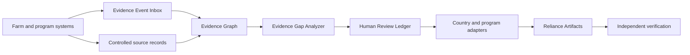

# AgEvidence

<p align="center">
  
</p>
<p align="center">
  <strong>Portable evidence infrastructure for agricultural climate programs.</strong>
</p>
<p align="center">
  Connect operational farm data, identify evidence gaps, preserve human review,
  and generate independently verifiable reliance artifacts.
</p>
<p align="center">
  <a href="https://agevidence.com"><strong>Website</strong></a>
  •
  <a href="#quickstart"><strong>Quickstart</strong></a>
  •
  <a href="#developer-os"><strong>Developer OS</strong></a>
  •
  <a href="#architecture"><strong>Architecture</strong></a>
</p>

<p align="center">
  
  
  
  
  
</p>

<p align="center">
  
</p>

## Overview
AgEvidence is the interoperability and reliance layer beneath agricultural
climate programs. It does not replace farm management systems, sensors,
laboratories, model providers or registries. It connects their records into a
portable evidence graph that institutions can inspect and rely upon.

| Connect | Resolve | Rely |
|---|---|---|
| Ingest signed events or controlled source records. | Detect missing evidence and preserve human review. | Generate bounded artifacts for named institutional uses. |

## How it works


## Product
| Surface | Purpose |
|---|---|
| **AgEvidence Workspace** | Inspect projects, source records, gaps, reviews and outputs. |
| **Evidence Event Inbox** | Receive append-only signed events from upstream systems. |
| **Developer OS** | Create projects and integrate through APIs, SDKs and webhooks. |
| **Country Programs** | Interpret one evidence graph through versioned local adapters. |
| **Reliance Artifacts** | Produce bounded outputs for buyers, verifiers and program operators. |
| **Portable Verification** | Verify released artifacts outside the hosted application. |

## Working demonstration
### Australian Beef Pilot
The seeded demonstration follows one agricultural climate project through:
1. Operational event and source-record intake
2. Evidence projection
3. Model execution
4. Evidence-gap detection
5. Human review
6. Reliance artifact generation
7. Independent verification
8. Methodology-version comparison

> The demonstration uses synthetic data. Sandbox prices, orders and model
> outputs are not represented as booked revenue, certified claims or production
> determinations.

## Quickstart
### Run the workspace
```bash
cd athian_ink_rails_bootstrap
bin/setup
bin/rails db:migrate db:seed
npm run build
bin/dev

Open:

http://localhost:3000/agevidence
<details>
<summary><strong>Run the Python model service</strong></summary>
cd services/agevidence-model
python3 -m pytest
</details>
<details>
<summary><strong>Install the Python SDK and CLI</strong></summary>
cd sdks/python
python3 -m pip install -e .
agevidence --help
</details>
<details>
<summary><strong>Build the verifier</strong></summary>
cargo test --workspace
cargo build -p baink-cli
</details>
```

## Developer OS
```python
from agevidence import AgEvidence
client = AgEvidence(
    base_url="http://localhost:3000",
    api_key="agev_test_local"
)
project = client.projects.create(
    name="Australian Beef Pilot",
    country="AU"
)
project.source_records.create(
    source_type="livestock_activity",
    uri="s3://example/activity-record.json"
)
quote = project.artifacts.quote(
    product="verification_bundle"
)
print(quote.verification_command)
```

## Architecture
```text
apps
• Rails workspace and human review
services
• Evidence-model service
sdks
• Python and TypeScript developer clients
specs
• Evidence contracts and country adapters
crates
• Canonicalization, receipts, bundles and verification

Trust boundary

The hosted Rails application presents workflow state and coordinates human
review. It does not directly perform canonical hashing, signing or independent
verification.

Those operations remain behind the released receipt and verifier boundary.

<details>
<summary><strong>Trust-boundary operations</strong></summary>
```ruby
InkReceipts.issue(...)
InkReceipts.verify(...)
InkReceipts.bundle(...)
InkReceipts.attest(...)
InkReceipts.export(...)
InkReceipts.migrate(...)
InkReceipts.graph(...)
InkReceipts.verify_bundle(...)
</details>

## Project status
| Capability | Status |
|---|---|
| Rails evidence workspace | Working prototype |
| Signed event intake | Working |
| Controlled source records | Working |
| Evidence-gap projection | Working |
| Human review ledger | Working |
| Python SDK and CLI | Working |
| Model-service integration | Fixture-backed |
| Artifact ordering | Sandbox |
| Country adapters | Scaffolded |
| Production certification | Not complete |

## Roadmap
- [x] Evidence Event Inbox
- [x] Controlled source-record path
- [x] Evidence-gap projections
- [x] Human review ledger
- [x] Python SDK and CLI
- [x] Sandbox artifact orders
- [ ] Hosted public demonstration
- [ ] TypeScript SDK package
- [ ] Australian program adapter validation
- [ ] External verifier review
- [ ] Production identity and access controls

## Contributing
AgEvidence is being developed as an evidence-infrastructure layer for
agricultural climate programs. Useful contributions include:
- agricultural data adapters;
- methodology test fixtures;
- schema review;
- verifier interoperability;
- SDK improvements;
- accessibility and interface work;
- documentation and examples.

See [`CONTRIBUTING.md`](CONTRIBUTING.md) before opening a pull request.

## Security
Do not report security vulnerabilities through public GitHub issues.
See [`SECURITY.md`](SECURITY.md).

## License
See [`LICENSE`](LICENSE).