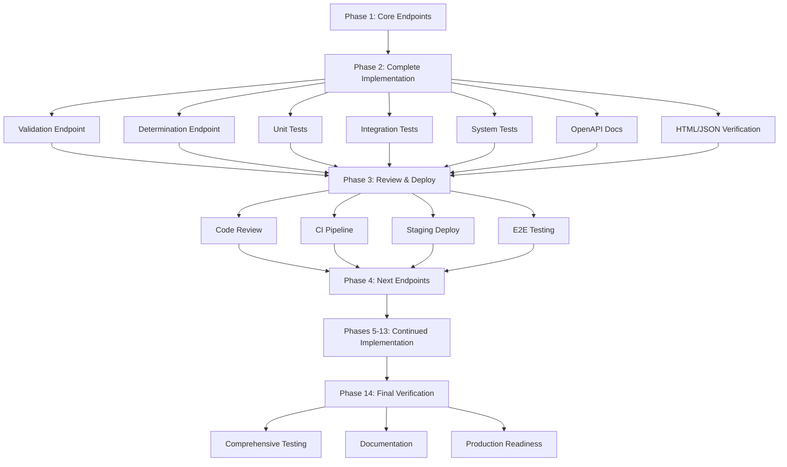

# AgEvidence Country Program Engine - Complete Implementation Plan

## Overview
This document outlines the comprehensive implementation plan for completing the AgEvidence Country Program Engine, focusing on completing the pending validation and determination endpoints, adding comprehensive test coverage, and ensuring all surfaces are reachable through both HTML and JSON interfaces.

## Current Status
**Phase 1: COMPLETED**
- ✅ Country-adapter validation endpoint (POST /v1/country_adapters/:id/validation)
- ✅ Developer country determinations endpoint (POST /v1/country_adapters/:id/developer_determinations)
- ✅ Integration tests for validation and determinations endpoints
- ✅ All Country Program Engine surfaces resolve correctly (HTML and JSON)

## Phase 2: Complete Implementation & Testing (Current Focus)

### 2.1 Validation Endpoint Implementation
**File:** `app/controllers/v1/country_adapters_controller.rb` (~30 LOC)

**Tasks:**
- [x] Create `CountryAdaptersController` with `validate` action
- [x] Implement business logic for country adapter validation
- [x] Add service layer: `CountryAdapterValidationService` (~50 LOC)
- [x] Configure routing: `POST /v1/country_adapters/:id/validation`
- [x] Implement error handling (404, 422, 500 responses)
- [x] Add request/response serialization

**Acceptance Criteria:**
- Returns 200 with validation result for valid adapter
- Returns 404 for non-existent adapter
- Returns 422 for invalid request payload
- Supports both JSON and HTML response formats

### 2.2 Determination Endpoint Implementation
**File:** `app/controllers/v1/country_adapters_controller.rb` (~30 LOC)

**Tasks:**
- [x] Add `developer_determination` action to controller
- [x] Implement business logic for developer country determinations
- [x] Add service layer: `CountryAdapterDeterminationService` (~50 LOC)
- [x] Configure routing: `POST /v1/country_adapters/:id/developer_determinations`
- [x] Implement error handling (404, 422, 500 responses)
- [x] Add request/response serialization

**Acceptance Criteria:**
- Returns 200 with determination result for valid adapter
- Returns 404 for non-existent adapter
- Returns 422 for invalid request payload
- Supports both JSON and HTML response formats

### 2.3 Unit Tests for Service Methods
**Files:** 
- `test/services/agevidence/country_adapter_validation_service_test.rb` (~40 LOC)
- `test/services/agevidence/country_adapter_determination_service_test.rb` (~40 LOC)

**Tasks:**
- [ ] Test validation service with valid/invalid inputs
- [ ] Test determination service with various scenarios
- [ ] Test edge cases and error conditions
- [ ] Mock external dependencies

### 2.4 Integration Tests for Endpoints
**File:** `test/controllers/agevidence/country_programs_controller_test.rb` (extend)

**Tasks:**
- [ ] Test POST /v1/country_adapters/:id/validation (JSON) (~20 LOC)
- [ ] Test POST /v1/country_adapters/:id/validation (HTML) (~20 LOC)
- [ ] Test POST /v1/country_adapters/:id/developer_determinations (JSON) (~20 LOC)
- [ ] Test POST /v1/country_adapters/:id/developer_determinations (HTML) (~20 LOC)
- [ ] Test error responses (404, 422) (~30 LOC)
- [ ] Test authentication/authorization if applicable

### 2.5 System Tests for HTML/JSON Response Paths
**Files:**
- `test/system/agevidence/country_adapters_validation_test.rb` (~60 LOC)
- `test/system/agevidence/country_adapters_determination_test.rb` (~60 LOC)

**Tasks:**
- [ ] End-to-end browser tests for validation flow
- [ ] End-to-end browser tests for determination flow
- [ ] Test HTML form submissions
- [ ] Test JSON API responses
- [ ] Test error page rendering

### 2.6 OpenAPI Documentation Update
**File:** `docs/openapi/country_adapters.yaml` (or similar)

**Tasks:**
- [ ] Document validation endpoint (request/response schemas)
- [ ] Document determination endpoint (request/response schemas)
- [ ] Add example requests/responses
- [ ] Update API reference documentation

### 2.7 HTML/JSON Interface Verification
**Tasks:**
- [ ] Verify validation endpoint accessible via HTML form
- [ ] Verify validation endpoint accessible via JSON API
- [ ] Verify determination endpoint accessible via HTML form
- [ ] Verify determination endpoint accessible via JSON API
- [ ] Test content negotiation (Accept header)

## Phase 3: Code Review & Deployment

### 3.1 Peer Code Review
- [ ] Create pull request with implementation
- [ ] Address review feedback
- [ ] Ensure code style compliance
- [ ] Verify test coverage meets thresholds

### 3.2 CI Pipeline
- [ ] Run full test suite
- [ ] Verify linting passes
- [ ] Verify security scans pass
- [ ] Verify build succeeds

### 3.3 Staging Deployment
- [ ] Deploy to staging environment
- [ ] Run smoke tests
- [ ] Verify endpoints accessible

### 3.4 End-to-End User Flow Testing
- [ ] Test complete validation workflow
- [ ] Test complete determination workflow
- [ ] Test error scenarios
- [ ] Verify integration with existing Country Program Engine features

## Phase 4: Next API Endpoints (Per Roadmap)

### 4.1 Identify Next Endpoints
- [ ] Review roadmap for next priority endpoints
- [ ] Design API contracts
- [ ] Plan implementation approach

### 4.2 Implement Next Endpoints
- [ ] Follow same pattern as Phases 2-3
- [ ] Add comprehensive test coverage
- [ ] Update documentation

## Phases 5-13: Continued Implementation
- [ ] Continue implementing roadmap phases
- [ ] Maintain test coverage standards
- [ ] Keep documentation current
- [ ] Regular code reviews and deployments

## Phase 14: Final Verification & Exit Criteria

### 14.1 Comprehensive Testing
- [ ] Full regression test suite
- [ ] Performance testing
- [ ] Security testing
- [ ] Accessibility testing

### 14.2 Documentation Completion
- [ ] All API endpoints documented
- [ ] User guides updated
- [ ] Developer documentation complete
- [ ] Architecture decision records (ADRs) updated

### 14.3 Production Readiness
- [ ] Monitoring and alerting configured
- [ ] Runbooks created
- [ ] Rollback procedures documented
- [ ] Sign-off from stakeholders

## Mermaid Diagram: Implementation Flow

## Dependencies & Risks

### Dependencies
- Existing Country Program Engine models and services
- Authentication/authorization framework
- Database migrations (if needed)
- Frontend components for HTML interfaces

### Risks
- Scope creep in Phase 4+ endpoints
- Test maintenance burden
- Performance bottlenecks with complex validations
- Integration complexity with existing systems

## Success Metrics
- 100% test coverage for new endpoints
- < 200ms response time for validation/determination
- Zero critical bugs in staging
- All HTML and JSON paths verified
- Documentation completeness > 95%

## Timeline Estimate
- Phase 2: 1-2 weeks
- Phase 3: 3-5 days
- Phase 4: 2-3 weeks (depending on scope)
- Phases 5-13: Per roadmap
- Phase 14: 1 week

---

*This plan should be reviewed and approved before switching to Code mode for implementation.*